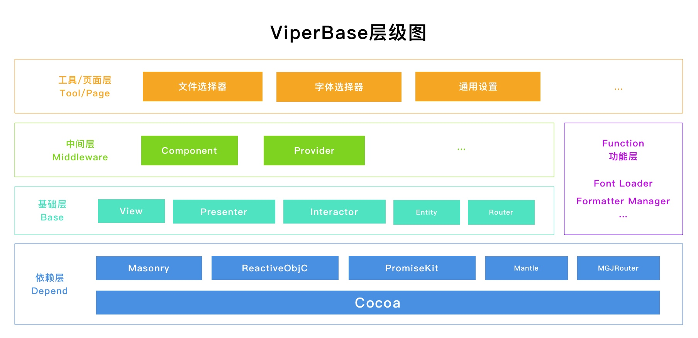

# 基础概念

**ViperBase**是一个类`VIPER`思想的开发框架，这种框架结构上主要由**View**视图，**Interactor**交互者、**Presenter**呈现者，**Entity**实例和**Router**路由器组成。

## Base层

### View

在五个基础组件中，**View**对应**UIView**、**UIControl**等，没有特别的派生类。

### Presenter

**Presenter**则是对应着`Apple MVC`中的**ViewController**，基础类**VB_Presenter**就是继承自**UIViewController**。

不过**Presenter**和**ViewController**扮演的角色却有些区别，在**ViperBase**中，**Presenter**只负责挂载`View`、管理APP的层级结构，和响应交互事件。

我们将`View`的样式修改代码，保留在`View`内部代码中，或使用`Apperence`进行全局设置；将UI的各种数据委托Delegate（一般为dataSource），通过**Component**的方式，转移到组件中；实际的功能代码，转移到`Interactor`中实现。

### Interactor

**Interactor**是完全从概念衍生出来的新类，这个类的主要工作就是代替Apple MVC中的**ViewController**实现大量**功能型**代码。

要如何定义功能型代码？这个问题一定需要一个明确的甄别方法，我的经验是要从四个方面分析：面向数据的、重复调用的、可脱离交互测试的、零耦合的，这个问题我在[如何理解Interactor？](HowToUnderstandInteractor.md)中有详细的说明。

### Entity 

`Entity`是App中各种数据的实例，很多朋友最早做App时候可能和我一样，对Entity，或者叫`Model`并不是很理解，写的代码里各种NSDictionary（OC的字典集合）横行，或者就是各种NSManageObject（CoreData的操作实例）。当然什么样的代码都能实现功能，这里并不是要说哪一种好，哪一种坏，而是明确一个点：App的核心功能是处理数据，而数据的实例是各种`Entity`。关于`什么是数据驱动交互？`请移步查看。

### Router

`Router`是目前唯一一个在功能上还没有完整定位的基础组件，目前仅用于管理全局变量。**Router**的潜在作用是做`依赖注入`，标准化App中每一个Page的带数据初始化流程。

## Middle层

中间层的两大类主要是**Component**（组件）和**Provider**(数据提供者)。其中`Component`专门配合`Presenter`使用，`Provider`专门配合`Interactor`使用。

这俩大类中间件（Middleware）都有明确的功能定位。**Component**主要提供UI支持，需通过`Presenter` 挂载才能使用，是系统控件、自制控件和第三方控件的中间适配器，很容以通过增加**Component**，批量替换App中同一类的交互功能，例如Alert（弹窗）、ActionSheet（行为表单）、HUD（提示浮层）等等。

**Provider**则是一般扮演DataSource的角色，是整个构架中真正的数据持有者。

## Function层

功能层的类设计，一般是脱离于主体框架，可以单独使用的，比如[VB_FontLoader](../Classes/Functions/VB_FontLoader.md)封装了系统导入字体的功能，[VB_FormatterManager](../Classes/Functions/VB_FormatterManager.md)提供一个全局的格式管理器，[VB_CollectionChange](../Classes/Functions/VB_CollectionChange.md)提供了数组比对的功能。

## Page/Tool层

Page或Tool一般为数个Presenter和Interactor组合出来对某块功能进行整体封装，一般可以在项目中灵活组合使用。

# 实践指导

## Page/Tool层

如果把一个完整App拆解开来看，UI/UE部分是App的外表，最基本的耦合单位应该是工具（Tool）或页面组（Page），Page和Page，或Page和Tool之间只存在依赖注入和事件反馈关系，各种Entity作为数据通信的载体，在各个Page之间流动。

## Middleware层

中间层是各种系统、第三方控件的桥接器，为了给Page/Tool提供统一的标准接口而存在，当项目引入、替换某一部分功能的时候，替换中间件的优势就非常明显，其一是不会对其他部分代码带来不可预测的影响，其二是单一中间件的基本零耦合，编写一个中间件可以在各种项目中使用。

## Function层

建议将只涉及逻辑，不涉及UI/UE的功能代码，放入Function层开发；涉及逻辑及UI/UE的代码，作为Page/Tool进行整体封装。

## Base层

`Presenter`和`Interactor`在实现Page/Tool时，建议继承基类扩展，在补充细节功能时，建议使用Category扩展。